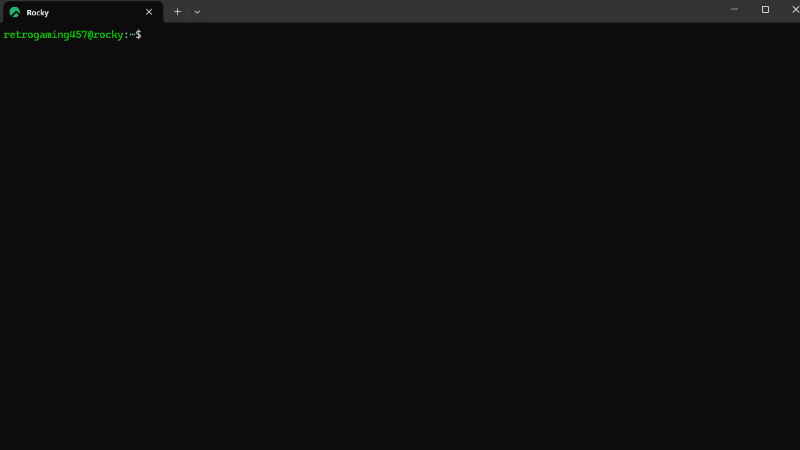
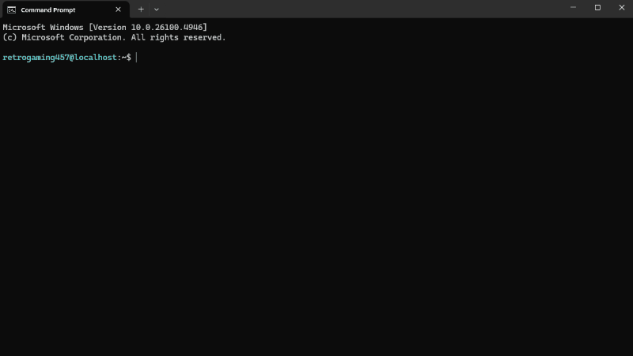

# awsctx
A simple AWS S3 context switcher to setup shell environments for `aws` as well as third-party S3-compatible tools like `s3cmd`, `s4cmd` and `s5cmd` 






## Supported Platforms

- Linux (Ubuntu / Rocky)
- Windows 10 / 11 (Command Prompt and PowerShell)

## Setup
#### Prerequisites
- `aws`
- `fzf`
- Optional: C++ compiler (only for Windows and if C++ launcher is prefered for robust shell detection)

#### S3-compatible CLI clients:
  
  - [s3cmd](https://github.com/s3tools/s3cmd) is one of the oldest third-party S3 clients. It is Python-based and has many features.

  - [s4cmd](https://github.com/bloomreach/s4cmd) is a faster and lightweight alternative to s3cmd, also Python-based. Better for bulk or high-performance operations, but less maintained.

  - [s5cmd](https://github.com/peak/s5cmd) is an extremely fast s3 client tool written in Go - designed for large-scale S3 operations.   

## Linux

1. Place `awsctx.sh` and other files in the appropriate locations:

```bash
~$ ~/.local/bin/awsctx.sh
~$ ~/.aws/config
~$ ~/.aws/credentials
~$ ~/.aws/certificate.pem  #if applicable
~$ ~/.aws/.bashrc_awsctx   #create an empty file
```

2. Run the following commands to set up your environment:
```bash
~$ echo 'export PATH="$HOME/.local/bin:$PATH"' >> ~/.bashrc
~$ echo "alias awsctx='source ~/.local/bin/awsctx.sh'" >>  ~/.bashrc
~$ echo "source ~/.aws/.bashrc_awsctx"  >> ~/.bashrc
~$ source ~/.bashrc
```

3. Install `awscli` and `fzf` tools:
```bash
~$ curl "https://awscli.amazonaws.com/awscli-exe-linux-x86_64.zip" -o "awscliv2.zip"
~$ unzip awscliv2.zip
~$ sudo ./aws/install
~$ which aws
/usr/local/bin/aws

#Redhat/Rocky
~$ dnf install fzf

#Debian/Ubuntu
~$ apt install fzf
```
4. Optional: other available S3-compatible CLI clients:
```bash
~$ pip install s3cmd
~$ pip install s4cmd

#s5cmd
~$ { 
  VERSION="2.3.0" 
  wget https://github.com/peak/s5cmd/releases/download/v${VERSION}/s5cmd_${VERSION}_Linux-64bit.tar.gz
  tar -xf s5cmd_${VERSION}_Linux-64bit.tar.gz s5cmd
  sudo mv s5cmd /usr/local/bin/
}
```
## Windows

1. Place `awsctx.cmd` and other files in the appropriate locations:
```batch
%BIN_DIR%\awsctx.cmd
%USERPROFILE%\.aws\config
%USERPROFILE%\.aws\credentials
%USERPROFILE%\.aws\certificate.pem  ::if applicable
```
2. Add folder of `awsctx` to system `PATH`
3. Install required tools via Chocolatey:
```batch
~$ choco install fzf aws
```

4. Optional: other available S3-compatible CLI clients:
```batch
~$ pip install s3cmd
~$ pip install s4cmd
~$ scoop install s5cmd
```


## Notes

### Config File Format

`awsctx` works with both types of AWS CLI config file — **Standard Config** and **Service-Specific Config** (indented format). 

### Adjustments based on preferred S3 Client Tool and envirnoment setup

Depending on your preference and envirnoment setup, some lines can be disabled or adjusted in the scripts.

For example, if your preferred S3 client tool is `s5cmd`, comment-out section of the script where it generates `s3cmd.ini` (or `.s3cfg` on bash script) for `s3cmd` and `s4cmd`. Also, `HOME` variable which is only exported by Windows batch script won't be necessary as it is only used by `s4cmd`. 

Also, if you are not using a custom certificate, search for `CERT_CASE` keyword in the script file you are using to adjust referenced sections accordingly. 


###  Shell Detection on Windows

  The batch script attempts to detect the current shell (CMD vs PowerShell), but **this can fail in nested shell environments** — for example, when cmd.exe is launched from PowerShell. In such cases, shell detection becomes unreliable in plain batch scripts.

  If you typically run `awsctx` in a single shell environment (e.g. directly from Command-Prompt or PowerShell), you won’t encounter any issues.

  However, for **more robust and accurate shell detection** — especially in environments where nested shells are common — use `awsctx.cpp` which handles shell detection and then, runs the batch script to setup aws/s3 profile in shell envirnoment (instructions in `README.md` under c++ directory)


### Self-Signed Certificate and `s3cmd`

If you use `s3cmd` on Windows and, your s3 endpoint uses a **self-signed certificate**, please be aware:

- `s3cmd` requiries the certificate to include **Authority Key Identifier (AKI)** and **Subject Key Identifier (SKI)** extensions. If your CA bundle **does not include AKI and SKI**, `s3cmd` may reject the certificate. A workaround is adding below snippet to `ssl_verified_context()` method in `s3cmd-2.4.0\S3\ConnMan.py` file to disable `VERIFY_X509_STRICT` flag:
```python
if context:
    try:
        context.verify_flags &= ~ssl.VERIFY_X509_STRICT
      except AttributeError:
```
